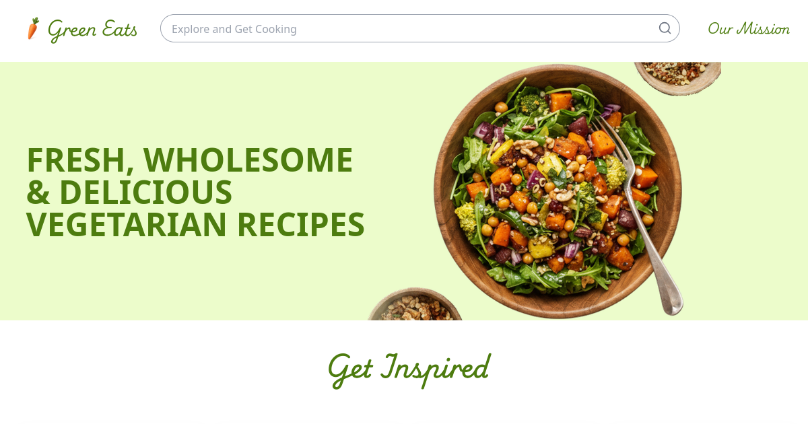

# Green Eats 🍃

[🌱 Visit the live website](https://vegetarianrecipewebsite.vercel.app/)



Vegetarian recipe website built with React, TypeScript, Redux Toolkit, Vite, and Tailwind CSS.

## Features
- Random and search recipes
- Recipe detail page
- State management with Redux
- Responsive design
- SEO and optimized meta tags
- Sticky footer
- Improved accessibility (aria-label)

## Local development

1. Clone the repository
2. Install dependencies:
   ```bash
   npm install
   ```
3. Create a `.env` file and add your Spoonacular API key:
   ```env
   VITE_SPOONACULAR_API_KEY=your_api_key
   ```
4. Start the development server:
   ```bash
   npm run dev
   ```

## Production build

```bash
npm run build
```

## Deploy on Vercel

1. Push to GitHub
2. Connect the repo to Vercel
3. Set the environment variable `VITE_SPOONACULAR_API_KEY`
4. Update meta tags in `index.html` with your production domain
5. Automatic deploy

## License
MIT
